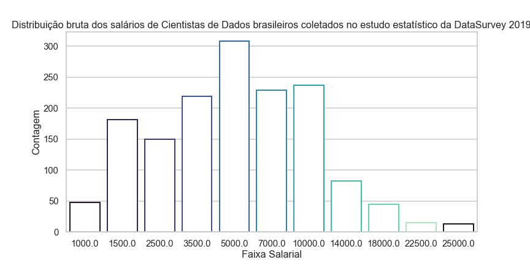
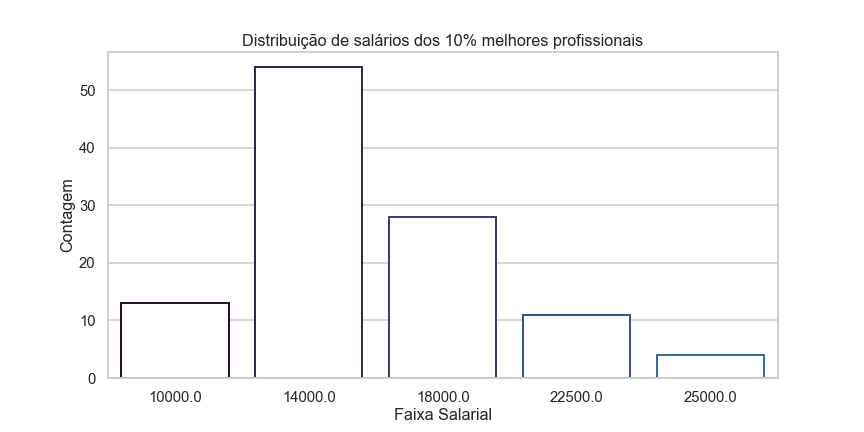

# Estudo sobre perfil dos melhores profissionais de Ciência de Dados no Brasil em 2019
## Introdução
&nbsp;&nbsp;&nbsp;Este estudo tem como objetivo analisar qual é o perfil dos melhores profissionais de Ciência de Dados no Brasil em 2019. Analisando um dataset com informações de diversos cientistas de dados de todo o Brasil, seleciona-se os 10% profissionais que ganham maiores salários, e se analisa quais são suas características. Desta forma, "melhores profissionais" refere-se aos profissionais mais requisitados pelo mercado, assumindo que maiores salários possuem relação direta com a qualidade do profissional considerado.  
&nbsp;&nbsp;&nbsp;Analisando o perfil destes melhores profissionais, pode-se ter uma noção geral de que caminho um profissional com menos experiência na área de Ciência de Dados deve trilhar para alcançar os mesmos resultados dos profissionais analisados.
## Metodologia
&nbsp;&nbsp;&nbsp;Para esta análise, tomou-se os dados de uma pesquisa realizada pelo Data Hackers em 2019. O dataset pode ser acessado através <a href="https://www.kaggle.com/datahackers/pesquisa-data-hackers-2019">deste link</a>. A pesquisa foi realizada em novembro de 2019 com diversas pessoas através de um formulário online. Na pesquisa, diversas informações foram coletadas, como onde o profissional mora, quanto ele ganha, qual seu tipo de contrato de trabalho, que tecnologias ele utiliza, entre outros.  
&nbsp;&nbsp;&nbsp;As informações coletadas no estudo foram utilizadas neste estudo para a análise de perfil do melhor profissional de Ciência de Dados. Filtrando informações relevantes, e tomando apenas os 10% profissionais com melhores salários, faz-se uma análise das informações destas pessoas, para perceber padrões comuns para este tipo de profissional. 
&nbsp;&nbsp;&nbsp;Para visualizar o notebook com todos os códigos realizados para o estudo, <a href="https://github.com/leonardovaladao/DS-Python-Projects/blob/master/EDA/DataHacker-Survey-2019/DS_Salary_Study_Best_Quarter.ipynb">clique neste link</a>.
## Estudo
### Análise Geral de Salários
&nbsp;&nbsp;&nbsp;Após uma simples preparação dos dados e seleção das informações mais relevantes para o estudo, foi realizado uma análise geral dos salários de todos os profissionais no estudo. Na pesquisa, os profissionais responderam quanto ganham através de suas faixas salariais, variando inicialmente de mil em mil reais (menos de R$1.000, de R$1.0000 a R$2.000, etc.) e após o valor de R$4.000, variando de dois em dois mil reais (de R$4.000 a R$6.000, de R$6.000 a R$8.000, etc.). Tomando a média desses valores (por ex., de R$6.000 a R$8.000 representando uma média de R$7.000 de valor salarial), foi analisado qual o salário médio de todos os profissionais que responderam a pesquisa. Com *n=1527*, o salário médio encontrado foi de *R$6.283,24*, sendo o desvio padrão da medida *R$4.633,44*. A imagem abaixo representa a distribuição das faixas salariais no estudo, com as barras representando as médias para cada faixa salarial disponível no formulário.
 

### Análise do Perfil dos Melhores Profissionais 
&nbsp;&nbsp;&nbsp;Após esta visão geral, foram filtrados apenas os profissionais que (1) afirmaram trabalhar atualmente como um profissional de Ciência de Dados, (2) afirmaram viver no Brasil, e (3) estão entre os 10% com maiores salários no estudo. Neste caso, restringimos o volume de dados para *n=110*. Para estes profissionais, foi calculado um salário médio de *R$15.795,45*, com desvio padrão de *R$3.790,12*. Abaixo pode-se ver a distribuição dos salários destes profissionais. 
 
&nbsp;&nbsp;&nbsp;Com isto, pode-se analisar uma série de informações para estes profissionais filtrados. Abaixo, segue uma lista com diversas informações descobertas com estes dados.  
**Segundo a pesquisa Data Survey realizado pelo Data Hackers em nov/19, dos 10% melhores profissionais que responderam a pesquisa:** 
Perfil pessoal:
- **Idade**: Possuíam em média 35 anos de idade, variando tipicamente entre 29 e 42 anos de idade.
- **Gênero**: 85% eram homens
- **Local de moradia**: 65% moravam no estado de São Paulo, enquanto 100% moravam na região Sul ou Sudeste do Brasil.
- **Formação acadêmica**: 46% possuíam pós-graduação, enquanto 21% eram graduados em bacharéis ou correlatos, 16% possuíam mestrado, e 12% doutorado.
- **Tipo de contrato de trabalho**: 56% possuíam contrato CLT, 32% possuíam contrato como pessoa jurídica, e 11% eram servidores públicos.
- **Liderança**: 54% destas pessoas ocupam cargo de liderança ou gerência.
- **Experiência profissional**: 30% destas pessoas possuíam mais de 10 anos de experiência na área de dados. 27% possuíam de 6 a 10 anos de experiência, 21% de 4 a 5 anos, 10% de 2 a 3 anos, e 8% possuíam entre 1 e 2 anos de experiência. 5% possuíam menos de 1 ano de experiência na área de dados.

Metodologias de ML utilizadas por estes profissionais:
- **Regressão Linear**: Utilizada por 76% destes profissionais.
- **Árvores de Decisão**: Utilizada por 71% destes profissionais.
- **Regressão Logística**: Utilizada por 65% destes profissionais.
- **Análise de Cluster**: Utilizada por 63% destes profissionais.
- **Florestas Aleatórias**: Utilizada por 58% destes profissionais.
- **Redes Neurais**: Utilizada por 41% destes profissionais.
- **Gradient Boosting**: Utilizada por 37% destes profissionais.
- **NLP**: Utilizada por 36% destes profissionais.
- **Inferência Bayesiana**: Utilizada por 34% destes profissionais.
- **Técnicas Ensemble**: Utilizada por 31% destes profissionais.

Linguagens mais utilizadas por estes profissionais:
- **Python**: 87% de aderência.
- **SQL**: 83% de aderência.
- **R**: 45% de aderência.
- **VBA**: 13% de aderência.
- **Java**: 11% de aderência.

Fontes de dados mais utilizadas:
- **SQL**: Utilizada por 97% destes profissionais.
- **Sheets**: Utilizada por 86% destes profissionais.
- **NoSQL**: Utilizada por 60% destes profissionais.
- **NLP**: Utilizada por 47% destes profissionais.
- **Imagens**: Utilizada por 27% destes profissionais.

Clouds mais utilizadas:
- **AWS**: 47% de aderência.
- **GCP**: 31% de aderência.
- **Azure**: 31% de aderência.
- **On Premise Server**: 25% de aderência.
- **Cloud Própria**: 17% de aderência.

DataBases mais utilizadas:
- **SQL Server**: 46% de aderência.
- **MySQL**: 40% de aderência.
- **PostgreSQL**: 39% de aderência.
- **Oracle**: 38% de aderência.
- **MongoDB**: 33% de aderência.

Ferramentas de Business Intelligence mais utilizadas:
- **Microsoft Power BI**: Utilizado por 49% dos profissionais.
- **Tableau**: Utilizado por 31% dos profissionais.
- **MetaBase**: Utilizado por 20% dos profissionais.
- **Qlik**: Utilizado por 15% dos profissionais.
- **Não utilizam BI**: 14% dos profissionais.

Formas mais comuns de se atualizar sobre a área de Ciências de Dados:
- **Blogs estrangeiros**: 59% dos profissionais.
- **Eventos e encontros**: 55% dos profissionais.
- **Canais no YouTube**: 44% dos profissionais.
- **Podcast estrangeiros**: 37% dos profissionais.
- **Blogs brasileiros**: 31% dos profissionais.
- **Grupos de WhatsApp**: 28% dos profissionais.
- **Grupos de Telegram**: 18% dos profissionais.
- **Twitter**: 17% dos profissionais.

Plataformas de cursos mais utilizadas por estes profissionais:
- **Coursera**: 66% dos profissionais.
- **Udemy**:  50% dos profissionais.
- **Udacity**: 36% dos profissionais.
- **EDX**: 30% dos profissionais.
- **Data Camp**: 26% dos profissionais.
- **Kaggle**: 19% dos profissionais.
## Conclusão
&nbsp;&nbsp;&nbsp;Algumas coisas podem ser inferidas através deste estudo. Apesar de possuir poucos dados para análise, podemos extrapolar os resultados de forma ampla. Considerando que a pesquisa, por si só, deve possuir um viés pois os profissionais que responderam o estudo possuem uma alta probabilidade de acompanhar algum tipo de conteúdo da plataforma Data Hackers, considerando que tomou-se no estudo dados de profissionais dos mais variados tipos de experiência, cargos, e locais do Brasil, assume-se que a pesquisa representa dados confiáveis acerca do estado dos profissionais de dados no Brasil em 2019.  
&nbsp;&nbsp;Percebe-se, para o perfil geral dos melhores profissionais, uma grande disparidade tangente ao gênero destes e local de moradia. Sabe-se que a região Sul e Sudeste possuem uma concentração de empresas de tecnologias no país, portanto justifica-se que a totalidade dos melhores profissionais morem nestas regiões. O fato de 85% dos melhores profissionais serem homens revela uma profunda desigualdade de gênero na profissão de Ciência de Dados, revelando que mulheres terão maiores dificuldades de trilhar um caminho próspero na área.  
&nbsp;&nbsp;&nbsp;Muito se discute sobre a necessidade de formação acadêmica para se ter sucesso na área de Ciência de Dados. O que este estudo se revela é que praticamente todos os melhores profissionais possuem algum tipo de formação acadêmica, a maioria possuindo graduação ou pós-graduação simples. Porém, poucos destes profissionais avançaram até o mestrado ou doutorado. No que tange o tempo de experiência profissional, quase 80% dos melhores profissionais possuíam mais de 4 anos trabalhando em Ciência de Dados. Conclui-se que o profissional da área que quer ter sucesso, deve sim procurar um tipo de formação acadêmica, porém sem precisar avançar muito neste sentido, e concentrando-se em adquirir tempo de experiência na área.  
&nbsp;&nbsp;&nbsp;Tendo em vista o tipo de trabalho do melhor profissional, virtualmente metade destes ocupam posição de liderança. Ou seja, podemos inferir que ocupar cargos de liderança não necessariamente está ligado ao sucesso profissional. Ao mesmo tempo, o tipo de contrato mais comum para estes profissionais é CLT, o que contraria alguns boatos da área de dados que diz que profissionais contratados como PJ obterão salários muito maiores.  
&nbsp;&nbsp;&nbsp;Quando olhamos para o perfil técnico deste profissionais, i.e., o tipo de ferramentas e metodologias que utilizam no seu trabalho, percebemos que existe uma forte diversificação das mesmas. Ou seja, um bom profissional de dados não se concentra em apenas uma metodologia ou ferramenta, mas possuem conhecimento em diversas, a fim de aplicar elas das melhores formas. Mesmo assim, notamos que algumas metodologias e ferramentas são mais comuns.  
&nbsp;&nbsp;&nbsp;Para metodologias de Aprendizado de Máquina, as mais comuns são Regressão Linear, Árvores de Decisão, Regressão Logística, Análise de Cluster, e Florestas Aleatórias. Apesar de não se limitar apenas isto, recomenda-se que um aspirante profissional de Ciência de Dados tenha forte conhecimento nestas técnicas. No que tange a linguagem, as mais utilizadas são Python e SQL, aliando uma linguagem de programação utilizada para métodos e algoritmos de ML, e uma linguagem de manutenção de bancos de dados. Ao mesmo tempo, SQL é a fonte de dados utilizada mais comumente, junto com planilhas e NoSQL.  
&nbsp;&nbsp;&nbsp;Para a forma de armazenamento de dados, as clouds mais utilizadas são AWS, GCP e Azure, enquanto que nelas os Bancos de Dados mais utilizados são SQL Server, MySQL e PostgreSQL. 
&nbsp;&nbsp;&nbsp;Para demonstrar os resultados dos estudos que realizam utilizando Ciência de Dados, muitos profissionais utilizam ferramentas de Business Intelligence, sendo as mais comuns neste estudo o Power BI, Tableau e Qlik. Entretanto, nem todos os melhores profissionais utilizam ou possuem conhecimento nestas ferramentas. 
&nbsp;&nbsp;&nbsp;Para se atualizar sobre a área de dados, as fontes variam, porém as mais comuns são blogs estrangeiros, eventos, e canais no YouTube. Para realizar cursos e se profissionalizar ainda mais, a maioria dos melhroes profissionais opta pelo Coursera ou Udemy.   
&nbsp;&nbsp;&nbsp;Todas as informações contidas nos parágrafos anteriores podem ser utilizadas por aspirantes na área de Ciência de Dados para guiar seu caminho de estudos e pesquisas na mesma. É claro que nenhum profissional deve se restringir no que estuda, porém ter direcionamento em seus estudos pode ser um fato importante para alavancar sua carreira profissional. Com o estudo aqui realizado, é possível ter uma noção do que os melhores cientistas de dados são e fazem, e assim se guiar desta forma para tornar-se também um excelente profissional.
